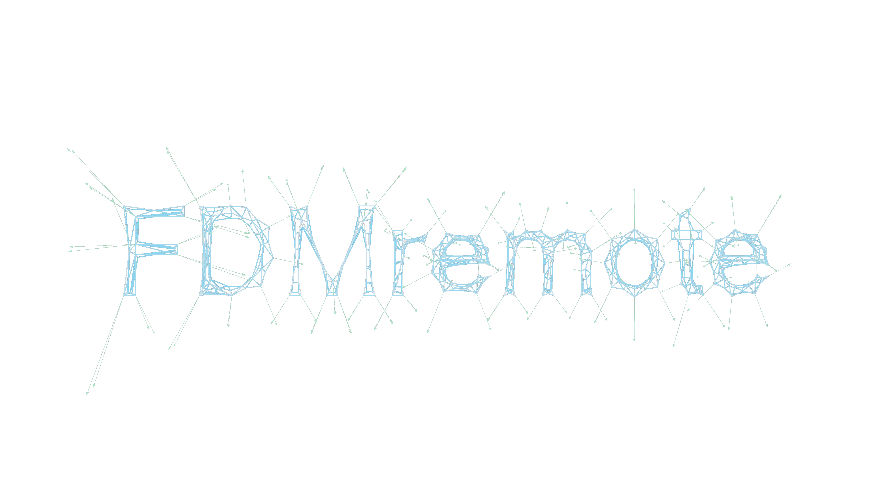

\

# FDMremote.jl
This is the back-end server implementation to interface with [FDMremote_GH](https://github.com/keithjlee/FDMremote_GH). Core functionality is provided by [FDM](https://github.com/keithjlee/FDM).

# Usage
- Add this package through your REPL: `] add https://github.com/keithjlee/FDMremote`
  
Then:

- `using FDMremote`
- `FDMsolve!()`

The server is now running.

**Notes:**
- The first time you solve/optimize a network, it will take some time (up to a minute) to get going. This is just an artifact of the Julia JIT compiler; if there are no scary error messages popping up, everything is working fine!
- It's recommended to start the local server `FDMsolve!()` before using the `FDMstart` component in Grasshopper.
- The server will run persistently until explicitly closed on the client side, or if the Julia session is terminated. If you close your Grasshopper session and start another one using `FDMremote`, the server will still be running and waiting for messages.

